<div align="center">



<br><br>

[](https://hackthenorth.com)
[](https://hackthenorth.com)
[](#test)
<br>
[](firmware/)
[](#getting-started)
[](LICENSE)

<br>

**[What it does](#what-it-does)** &nbsp;·&nbsp;
**[Architecture](#architecture)** &nbsp;·&nbsp;
**[How it works](#how-it-works)** &nbsp;·&nbsp;
**[Get started](#getting-started)** &nbsp;·&nbsp;
**[Hardware](#hardware)** &nbsp;·&nbsp;
**[Demo](#demo)** &nbsp;·&nbsp;
**[Team](#team)**

<br>


<br><br>

> *Ever wanted to be Spider-Man? Or maybe you've just related a little too much to
> Peter Parker lately? Either way, you can't exactly get bitten by a radioactive
> spider at Hack the North… so we built the next best thing.*

**SpideyIRL turns nearby distance measurements into directional touch,
with voice access to visual context.**

</div>

<details>
<summary><b>📖 Full table of contents</b></summary>

<br>

| # | Chapter | Inside |
| :---: | --- | --- |
| 01 | [What it does](#what-it-does) | [Why](#why) |
| 02 | [System architecture](#architecture) | [Two devices, three paths](#two-devices-three-paths) · [The layers](#the-layers) |
| 03 | [How it works](#how-it-works) | [Direction mapping](#direction-mapping) · [Distance → vibration](#distance--vibration) · [Voice commands](#voice-commands) |
| 04 | [Getting started](#getting-started) | [Eyes & Voice](#eyes--voice-laptop-or-linux-pi) · [Spidey Sense firmware](#spidey-sense-qnx-pi-firmware) · [Test](#test) · [Latency logs](#latency-logs) |
| 05 | [Configuration](#configuration) | |
| 06 | [Hardware](#hardware) | [Sensor wiring](#sensor-wiring) |
| 07 | [The 90-second demo](#demo) | |
| 08 | [Ground rules & boundaries](#ground-rules) | [Ground rules we built to](#ground-rules-we-built-to) · [Prototype boundaries](#prototype-boundaries) |
| 09 | [What's next](#whats-next) | |
| 10 | [Repository layout](#repository-layout) | |
| 11 | [The team](#team) | [License](#license) |

</details>

<br>

<a name="what-it-does"></a>

Peter's Spidey Sense is a tingle that tells him *where* danger is before he sees
it. Ours works the same way, minus the radioactive spider.


- **🕸️ Feel where things are.** Eight ultrasonic range sensors around a headband
  each drive a vibration motor on the same side of your head. Something on your
  left → your left temple buzzes. The closer it gets, the faster the pulses.
  Eight directions, 45° apart, all relative to where your head is pointing.
- **👁️ Ask what it is.** Say *"what's in front of me"* and a camera + YOLO object
  tracker + multimodal assistant answer out loud: *"A person is visible on the
  left of the camera view."* Voice in, voice out, no hands.
- **🔌 Keep working when the smart parts don't.** Vibration comes from local
  sensor readings only: no camera, no cloud, no Wi-Fi, not even the same
  computer. If the assistant is offline, it says so. The tingle keeps tingling.

### Why

Spider-Man's real superpower isn't the webs, it's *knowing where things are
without looking*. That's exactly what's missing when visibility is gone: a
firefighter in smoke, a diver in silt, someone navigating without sight.

Those are the futures we're building toward, and each one needs its own hardware
and validation. What we built this weekend is the honest indoor prototype: a
stationary wearer, soft objects, a dry room, and a device that tells you where
they are.

<br>

<a name="architecture"></a>


> [!NOTE]
> This diagram illustrates the intended architecture. The current build uses
> ultrasonic sensors rather than the depicted ToF ring; Vosk handles the configured
> command grammar, and the cross-device haptic alert connection shown here is not
> implemented. See [System Architecture](SYSTEM_ARCHITECTURE.md) for implementation
> details.

### Two devices, three paths

The build ships on **two independent Raspberry Pis** worn on the same headband,
with **no link between them**. The reflexes never wait on the brain.


### The layers

| Layer | Where | Notes |
| --- | --- | --- |
| **Sensor → haptic firmware** (C, QNX) | [`firmware/`](firmware/) | Reads all eight channels every ~200 ms, prints `name · band · mm` per channel, and re-applies the pulse pattern every 10 ms so fast cadences render cleanly. Sensors fire in two alternating trigger groups (cardinals / diagonals) so neighbours never ping at once. A missed echo is `unknown`, never a distance. See [`firmware/README.md`](firmware/README.md). |
| **Live object tracking** | [`computer-vision/track_distances.py`](computer-vision/track_distances.py) | Ultralytics 8.4 tracking with the committed Objects365 checkpoint `yolo26n-objv1-150.pt` on camera `0` or a replay file. Overlays cloud / camera state; on camera loss shows **CAMERA UNAVAILABLE** and reconnects with 0.5–5 s backoff. |
| **`SceneState` evidence layer** | [`computer-vision/scene_state.py`](computer-vision/scene_state.py) | One immutable latest snapshot: original frame, detections (class from the checkpoint's own `model.names`, confidence, box, track ID, left/centre/right region), freshness, `live` / `replay` / `simulated` source, image-quality floor, session generation. |
| **Offline speech** | [`speech/`](speech/) | Vosk grammar-limited recognition, Piper synthesis, `LOW / NORMAL / HIGH` priority queue with interrupt, TTL, repeat suppression, echo guard, optional wake phrase, per-subsystem health, and a question recorder that bypasses Vosk. |
| **Assistant client** | [`omni/`](omni/) | `qwen3.5-omni-flash` via an OpenAI-compatible endpoint. Bytes-only requests, one in flight at a time, killable subprocess with a hard deadline, sanitised token-usage ledger, `FakeOmniClient` for offline runs. |
| **Orchestrator** | [`main.py`](main.py) | Wires camera, speech, and one assistant question at a time. Structured JSON-lines logs with per-question timings. |
| **Versioned config** | [`configs/`](configs/) | `speech.json`, `assistant.json`, `grammar.json`, all `schema_version` 1, validated on load. |

Each subfolder has its own README, [`SYSTEM_ARCHITECTURE.md`](SYSTEM_ARCHITECTURE.md)
covers the companion-host software in depth, and [`docs/DEPLOYMENT.md`](docs/DEPLOYMENT.md)
is the two-device runbook.

<br>

<a name="how-it-works"></a>

### Direction mapping

Directions are relative to the wearer's head, clockwise from above. One
versioned mapping ([`firmware/channels.c`](firmware/channels.c)) is used
everywhere: firmware, telemetry, tests, audio.


<div align="center">

| Channel | Bearing | Motor | Trigger group | | Channel | Bearing | Motor | Trigger group |
| --- | :---: | :---: | :---: | --- | --- | :---: | :---: | :---: |
| `front` | 0° | `motor_0` | 🔴 A | | `rear` | 180° | `motor_4` | 🔴 A |
| `front_right` | 45° | `motor_1` | 🔵 B | | `rear_left` | 225° | `motor_5` | 🔵 B |
| `right` | 90° | `motor_2` | 🔴 A | | `left` | 270° | `motor_6` | 🔴 A |
| `rear_right` | 135° | `motor_3` | 🔵 B | | `front_left` | 315° | `motor_7` | 🔵 B |

</div>

Group A (cardinals) and group B (diagonals) share a trigger line each and fire
alternately, so two adjacent sensors are never listening for the same echo.

### Distance → vibration


The firmware does two things with every filtered reading:

**1. Classifies it into a band** (with 50 mm hysteresis so a reading sitting on
a boundary doesn't flicker). Escalation is immediate; de-escalation waits until
the reading has cleared the boundary.

| Band | Valid distance | Meaning |
| --- | --- | --- |
| 🟥 `urgent` | ≤ 0.4 m | Something is right there |
| 🟧 `near` | 0.4 – 0.8 m | Close |
| 🟨 `mid` | 0.8 – 1.5 m | Approaching |
| 🟦 `far` | 1.5 – 3.0 m | On the radar |
| ⬜ `beyond` | > 3.0 m | Seen, but no alert |
| ⬛ `unknown` | missing / stale / invalid | **No pulse.** Reported as a fault, never as "clear". |

**2. Drives the motor at a pulse rate that scales continuously with distance**:
up to 10 Hz at 0 mm, silent at 3.5 m and beyond, 30 % on-time per pulse so each
buzz stays short and distinct:

```
pulse rate (Hz) = 10 × (1 − distance / 3500 mm)
```

| Distance | 3.0 m | 1.5 m | 0.8 m | 0.4 m | 0.1 m |
| --- | :---: | :---: | :---: | :---: | :---: |
| Pulses / second | ~1.4 | ~5.7 | ~7.7 | ~8.9 | ~9.7 |

> [!IMPORTANT]
> These are **indoor bench defaults**, not measured or validated distances. The
> band thresholds, hysteresis, median window (3 samples), and pulse constants are
> compile-time values with `TODO: tune` next to every one of them. Comfort tuning
> on skin hasn't happened yet.

### Voice commands

The recogniser is limited to the twelve phrases in
[`configs/grammar.json`](configs/grammar.json), which is what keeps offline
recognition fast and reliable. Every phrase has a handler, checked at startup.

| Say | What happens |
| --- | --- |
| 🗣️ **what's in front of me** | Sends the current camera frame with a fixed prompt to the assistant and speaks the answer. No recording. |
| 🎙️ **describe** | Plays a short listening tone, records **2 s** of your open-vocabulary question (raw mic audio, bypassing Vosk), sends audio + frame to the assistant, and speaks the answer. |
| 🩺 **device status** | Speaks speech, listening, cloud, camera, and question state, e.g. *"Speech ready, listening ready, cloud off, camera live, question idle."* |
| 🤫 **stop speaking** | Cancels current and queued speech. Always active, even with a wake phrase enabled. |
| 🔊 **volume up** / **volume down** | Bounded levels 1–5 (default 5); confirmed aloud. |
| 🔇 **mute** / **sound on** | Mute keeps `HIGH`-priority alerts and the spoken confirmation; the mic stays live so *"sound on"* still works. |
| ⏸️ **pause feedback** / **resume feedback** / **increase sensitivity** / **decrease sensitivity** | Recognised, but reply *"Haptic controls are not available yet."* There is no host ↔ controller configuration bridge. |

Only one question is in flight at a time; a second one gets *"Still answering."*
(never during recording, so it can't talk over you). Answers need a camera
snapshot no older than 0.5 s with acceptable image quality, or you hear that the
camera view is unavailable. Answers play at `LOW` priority so an alert can
always interrupt them.

Wake phrase is **off** by default (`wake_phrase: null` in `configs/speech.json`).

<br>

<a name="getting-started"></a>

### Eyes & Voice (laptop or Linux Pi)

Runs on any machine with a webcam, microphone, and speaker. No sensors or
motors needed.

```bash
git clone https://github.com/adi-padmarajan/Sixth-Sense.git
cd Sixth-Sense

# One-shot: venv + requirements.txt + Piper/Vosk models + import checks
bash scripts/setup_eyes_voice.sh
source .venv/bin/activate
```

<details>
<summary>Or set it up by hand</summary>

```bash
python --version                         # 3.11+ (developed on 3.13)
pip install -r requirements.txt          # speech, vision, assistant, and test deps
bash scripts/fetch_models.sh             # Piper voice (~60 MB) + Vosk model (~40 MB)
```

</details>

The YOLO checkpoint `computer-vision/yolo26n-objv1-150.pt` is committed; nothing
is downloaded implicitly at startup.

#### Run it

Always run from the repository root.

```bash
# Full demo, everything local. Cloud off: you'll hear "system ready. cloud off."
python main.py

# Same, with canned assistant answers (still real camera, mic, and speaker)
OMNI_FAKE=1 python main.py

# Enable the cloud assistant for real scene answers
export YIBU_API_KEY='…'     # current shell only, never commit it
python main.py --cloud

# Replay an image or video instead of camera 0
python main.py --source path/to/clip.mp4
```

While running, say **"what's in front of me"** and listen. The preview window
labels cloud (`off` / `fake` / `on`) and camera (`live` / `replay` / `low quality`
/ `unavailable`) state. Press `q` in the preview or `Ctrl-C` to quit.

> [!WARNING]
> Camera media leaves the machine **only** with `--cloud`. If `--cloud` is set
> without `YIBU_API_KEY`, startup logs a warning and questions answer
> "unavailable" instead of crashing.

<details>
<summary>Smaller pieces on their own</summary>

```bash
python example-usage.py                    # speech only: say a command, see it handled
python scripts/check_capture.py            # mic check: records 3 s and writes a WAV
python computer-vision/track_distances.py  # camera + YOLO preview only
env -u YIBU_API_KEY python -m omni.demo    # synthetic scene → fake assistant → fake TTS, no devices
python -m omni.demo --live --audit-log /tmp/live-check.jsonl   # ONE billable provider call
```

</details>

Deploying on a headless Raspberry Pi (ARM wheels, `cv2.imshow`, PortAudio,
camera index, optional systemd unit)? See [`docs/DEPLOYMENT.md`](docs/DEPLOYMENT.md).

### Spidey Sense (QNX Pi firmware)

The sensor → haptic loop is plain C, built with the **QNX Software Development
Platform**, either cross-compiled from your laptop (`qcc` on `PATH`, `QNX_HOST`
set) or self-hosted on the QNX Pi with `clang`. It cannot be built with a plain
host gcc/clang; it needs `<sys/neutrino.h>` and the `rpi_gpio` resource manager.
No Python, no `pip`, no network on this device, by design.

```bash
cd firmware
make                                            # aarch64le, debug
make PLATFORM=armv7le BUILD_PROFILE=release     # match your Pi's QNX image
```

Output: `firmware/build/<platform>-<profile>/sixth_sense_firmware`.

```bash
scp build/aarch64le-release/sixth_sense_firmware qnxuser@<spidey-sense-pi>:/tmp/
ssh qnxuser@<spidey-sense-pi> /tmp/sixth_sense_firmware
```

You'll see one line per channel roughly every 200 ms, with `unknown` for any
sensor that didn't return an echo:

```
front        near                712 mm
front_right  unknown               0 mm
right        far                2140 mm
...
```

> [!TIP]
> To isolate a silent motor into "software" vs "hardware", the standalone
> bring-up tool holds GPIO pins high without any sensor gating:
>
> ```bash
> ./build/motor_gpio_test 5 14           # hold BCM 14 (rear) HIGH for 5 s
> ./build/motor_gpio_test 5 14 4 17 27   # four pins together
> ```

See [`firmware/README.md`](firmware/README.md) for wiring, build details, how to
read the bring-up results, and the full list of what is and isn't done.

### Test

All offline: no camera, mic, sensors, network, GPU, or API key.

```bash
env -u YIBU_API_KEY python -m pytest tests omni/tests computer-vision/Tests -q
# → 224 passed

env -u YIBU_API_KEY python -W error -m pytest omni/tests -q   # warnings as errors
```

Coverage includes: grammar / handler wiring, speech priority / mute / TTL /
dedup, question capture, scene freshness and immutability, image-quality
boundaries, camera-reconnect fault injection, assistant deadlines (real stalled
subprocesses, no sockets), audit-ledger sanitisation, and latency summarisation.

The QNX firmware has no automated tests. Its policy files (`proximity_*.c`,
`haptic_pattern.c`) are pure functions with no hardware dependency, but the
driver can only be exercised on the QNX Pi itself.

### Latency logs

`main.py` emits JSON-lines events with `capture_ms`, `assistant_ms`, `total_ms`
(recognition → completion), and `speech_started_ms` (first PCM handoff).

```bash
python main.py 2> demo.log
python scripts/summarize_latency.py demo.log     # or `-` for stdin
```

Counts, p50, p95, and max are split by status and capture mode. This is
**software timing**, not measured acoustic onset or motor response. Live vendor
ledgers are git-ignored; committed historical examples live in
[`omni/artifacts/examples/`](omni/artifacts/examples/).

<br>

<a name="configuration"></a>

Everything tunable on the host lives in [`configs/`](configs/), versioned and
validated on load.

| File | Key settings (current values) |
| --- | --- |
| `speech.json` | 16 kHz mono · `question_seconds: 2.0` · `max_capture_seconds: 10` · `echo_guard_seconds: 0.3` · `max_command_age_seconds: 2` · `dedup_window_seconds: 2` · `wake_phrase: null` · `always_on_commands: ["stop speaking"]` · `listening_tone: true` |
| `assistant.json` | `cloud_enabled: false` · `omni_model: qwen3.5-omni-flash` · `omni_timeout_s: 6` · `max_scene_age_ms: 500` · `answer_within_ms: 6000` · `frame_jpeg_width: 480` · `max_tokens: 96` · audit-ledger path |
| `grammar.json` | The 12 recognisable phrases; every word is checked against the Vosk model's vocabulary at startup |

Firmware thresholds (bands, hysteresis, median window, pulse constants, pin
map) are compile-time constants in [`firmware/`](firmware/). A versioned config
file for the controller is on the [roadmap](#whats-next).

> [!CAUTION]
> Credentials come only from the `YIBU_API_KEY` environment variable. There is no
> key in the repo, no key file, and proxies are never read (`trust_env=False`).

<br>

<a name="hardware"></a>

| Part | Choice | Notes |
| --- | --- | --- |
| 📡 Range sensors | 8× HC-SR04-class ultrasonic (AJ-SR04M at the front) | Two shared trigger lines fired alternately to avoid cross-talk; 30 ms echo timeout; a missed echo is `unknown`, not "clear" |
| 🧠 Controller | Raspberry Pi running **QNX**, GPIO via BlackBerry's `rpi_gpio` resource manager | Sensor loop runs at `SCHED_FIFO` real-time priority; vendored client under `firmware/third_party/` |
| 📳 Vibration | 8 motors, one per direction, driven from GPIO | Only `rear` (BCM 14) has an assigned pin; driver-stage, pulse-width, and comfort limits still to be measured |
| 💻 Companion host | Second Raspberry Pi (Linux) or a laptop | Camera, mic, speaker. Off-head compute during the demo, disclosed as such |
| 🎧 Mount | Adjustable headband | Helmet compatibility is a future goal |

### Sensor wiring

BCM numbering, mirrored as comments in [`firmware/channels.c`](firmware/channels.c);
the original hand-written map is [`pin_map_pi.md`](pin_map_pi.md).

| Signal | BCM | | Signal | BCM |
| --- | :---: | --- | --- | :---: |
| 🔴 Trigger · group A (cardinals) | 11 | | 🔵 Trigger · group B (diagonals) | 5 |
| Echo · `front` | 17 | | Echo · `front_right` | 2 |
| Echo · `right` | 3 | | Echo · `rear_right` | 4 |
| Echo · `rear` | 9 | | Echo · `rear_left` | 27 |
| Echo · `left` | 22 | | Echo · `front_left` | 10 |
| Motor · `rear` | 14 | | Motor · all others | *unassigned* |

> [!NOTE]
> Eight sensors 45° apart do **not** give continuous 360° coverage. There are
> gaps between beams, and a horizontal ring doesn't see steps, holes, or overhead
> hazards. We describe it as eight-direction sensing until we've measured
> otherwise.

<br>

<a name="demo"></a>

Participant stationary, soft objects, dry indoor room. Both Pis run side by
side with no software integration step between them.

| | Beat | What you see |
| :---: | --- | --- |
| **1** | 🧭 **Explain the mapping** | Eight directions around the head; nearer means faster pulses. |
| **2** | 🧸 **Move a soft object** | Between directions on the Spidey Sense Pi, then closer. Watch the printed band change per channel; feel the motor where one is wired. |
| **3** | 🗣️ **Ask a question** | *"What's in front of me?"* → spoken description of the visible scene. Then change a setting by voice: *"volume down"* → confirmed aloud. |
| **4** | 📴 **Pull the network** | Ask again: the assistant reports itself unavailable. The sensor loop on the other Pi never noticed. |
| **5** | 🙈 **Cover the camera** | Preview shows **CAMERA UNAVAILABLE**; questions answer "camera view is unavailable"; haptics continue. |

Present smoke, darkness, and underwater operation as future validation
questions, not demonstrated capabilities.

<br>

<a name="ground-rules"></a>

### Ground rules we built to

- 🤖 Distance → vibration is a fixed, testable mapping. **No AI model ever touches
  a motor.**
- ❔ Missing, stale, or invalid readings are **unknown**, never empty space.
- 🧾 Sensor measurements, camera detections, and assistant interpretations stay
  distinguishable end to end. The assistant says *"A person is visible ahead"*
  and the sensor says *"obstacle about one metre in front"*. We never glue the
  sensor's distance onto the camera's object without a real association.
- ⚡ The reflex loop lives on its own device. It cannot block on HTTP, inference,
  speech, logging, or the other Pi existing at all.
- ☁️ Cloud is off by default, visible when on, and only ever sees one frame and
  one question at a time. Credentials come from the environment, never code.
  The audit ledger stores token counts and status, never prompts, images,
  audio, or replies.
- 🔒 No recording by default, no identity recognition, no bystander retention.
  Camera and audio buffers are short-lived and in-memory.
- ✋ A driver acknowledgement is not a vibration. Motor output is unverified until
  someone has felt it.

### Prototype boundaries

> [!WARNING]
> This is a hackathon prototype demonstrated with a stationary wearer, soft
> movable objects, and a dry, well-lit indoor room. It is **not** certified,
> fireproof, waterproof, or a replacement for any protective, rescue, or mobility
> equipment. It does not plan routes, guarantee obstacle avoidance, or build a 3D
> map. The pixel distances drawn on the preview are image-space measurements
> between objects, not real-world ranges. Please don't blindfold yourself and walk
> into traffic with it. With great power, etc.

<br>

<a name="whats-next"></a>

Roughly in order:

- [ ] Assign the remaining seven motor pins in `channels.c` and confirm each motor by touch
- [ ] Measure per-channel revisit rate, sample → motor latency, usable range, and beam coverage on the assembled band
- [ ] Tune band thresholds, hysteresis, and pulse constants on skin
- [ ] Bounded / expiring motor commands, watchdog, and a physical stop
- [ ] Read-only telemetry export from the QNX Pi to a live monitor
- [ ] Host → controller configuration bridge so *"pause feedback"* and *"increase sensitivity"* actually do something
- [ ] Headless (`--no-show`) mode for the camera preview on a display-less Pi

<br>

<a name="repository-layout"></a>


```
main.py                  orchestrator: camera + speech + one assistant question at a time
example-usage.py         speech-only smoke test
firmware/                C firmware for the QNX Spidey Sense Pi: sensors, filter, bands, haptic pattern, motor GPIO, Makefile
  └─ third_party/        vendored BlackBerry rpi_gpio resource-manager client
computer-vision/         YOLO tracker, SceneState, offline tests, committed Objects365 checkpoint
speech/                  Piper TTS + Vosk STT service, fakes, downloaded models (git-ignored)
omni/                    assistant client, scene request builder, fake, vendor CLIs, audit ledger
sensor_python/           legacy Python sensor reference (SensorDriver protocol, pigpio driver, fake)
configs/                 speech.json · assistant.json · grammar.json   (all schema_version 1)
scripts/                 setup_eyes_voice.sh · fetch_models.sh · check_capture.py · summarize_latency.py · make_readme_art.py
deploy/                  systemd unit template for the Eyes & Voice host
docs/DEPLOYMENT.md       two-device runbook: QNX Spidey Sense Pi + Linux Eyes & Voice Pi
docs/readme/             README artwork (generated by scripts/make_readme_art.py)
tests/                   orchestrator, speech, and latency tests (+ fixtures)
pin_map_pi.md            hand-written sensor/trigger pin map (source of truth for channels.c)
SYSTEM_ARCHITECTURE.md   companion-host software architecture in depth
proj_spec.md             original project spec and open questions
AGENTS.md / CLAUDE.md    engineering guidance for contributors and coding agents
```

<br>

<a name="team"></a>

<div align="center">

Built at **Hack the North 2026** 🥉 **3rd Place, QNX: Embedded Systems with QNX that uses AI**

| 🕷️ | 🕷️ | 🕷️ | 🕷️ |
| :---: | :---: | :---: | :---: |
| **Aditya Padmarajan** | **Halie Favron** | **Noah Valentin Klaholz** | **Chris Dietrich** |

<a name="license"></a>
[MIT](LICENSE) © 2026 Aditya Padmarajan

<br>


</div>
