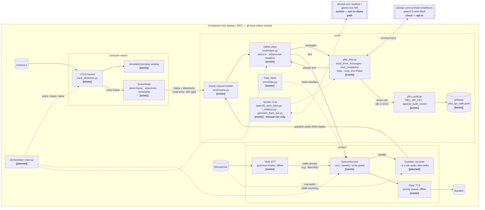
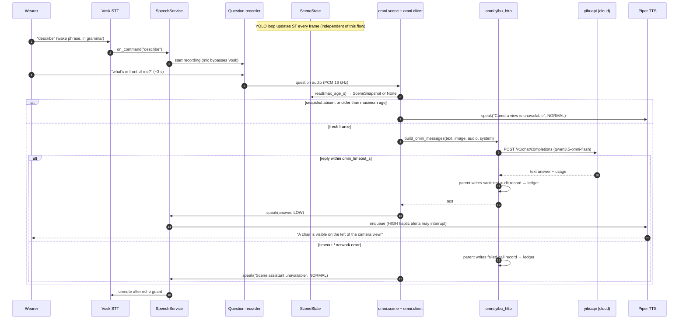

# Sixth-Sense — Software Architecture (YOLO + Vosk/Piper + OMNI)

> Scope: the companion-host software only — local vision (YOLO), local voice
> I/O (Vosk STT, Piper TTS), and the cloud OMNI multimodal assistant.
> Proximity sensors, haptics, and firmware are a separate local path and are
> deliberately **not** described here.
>
> Status legend used throughout: **[exists]** = in the repo today,
> **[planned]** = agreed design, not yet written.

## 1. One-paragraph summary

The wearer says a wake phrase, then asks a question ("what's in front of me?").
Vosk (offline, grammar-limited) catches the wake phrase; the next few seconds
of microphone audio are recorded. That audio, the current camera frame, and
YOLO's structured detection list are sent in **one** request to an OMNI model
(`qwen3.5-omni-flash` via the yibuapi OpenAI-compatible endpoint; Gemini Live
is a stretch option). The model returns a short text answer, which
is played through the existing priority-aware speech queue. If the network is
down, the assistant reports itself unavailable; YOLO preview and local speech
keep running.

## 2. Components

| Component | Location | Status | Role |
| --- | --- | --- | --- |
| YOLO tracker | `computer-vision/track_distances.py` | [exists] | Ultralytics tracking on camera `0` with the local Objects365 checkpoint; annotated preview; object-to-object **pixel** distances |
| Scene state | `computer-vision/scene_state.py` | [exists] | Thread-safe latest original frame + detections + monotonic result-receipt timestamp; immutable snapshots, freshness filtering, and reset |
| Vosk STT | `speech/stt.py` | [exists] | Offline recognizer restricted to `configs/grammar.json` (words validated against the model at startup); background mic thread; fires `on_command(text, recognized_at, source_mode)` |
| Piper TTS | `speech/tts.py` | [exists] | Offline synthesis with `LOW / NORMAL / HIGH` priority queue and interrupt |
| SpeechService | `speech/service.py` | [exists] | Singleton facade: `speech.on(cmd, handler(Command))`, `speech.speak(text, priority)`; mutes the mic while the speaker plays (echo guard); optional wake-phrase arming; per-subsystem health |
| SpeechConfig | `speech/config.py`, `configs/speech.json` | [exists] | Validated, versioned settings: model paths, devices, timing, queue limits, wake phrase |
| Question recorder | `speech/` (extension) | [planned] | After a wake phrase, capture ~3 s of raw mic audio for the assistant instead of feeding it to Vosk |
| yibu HTTP transport | `omni/yibu_http.py` | [exists] | `build_omni_messages(prompt, image=Path/MediaBytes, audio=Path/MediaBytes, system=…)` → OpenAI-style content parts (text, `image_url` data-URL, `input_audio` data-URL); `chat_completion(...)` POSTs to `https://yibuapi.com/v1/chat/completions` with `httpx` (`trust_env=False`, **configurable timeout, 300 s vendor default**), returns `(text, response_json, audit_record)`, audits every call; `extract_text()` flattens the reply |
| Call audit ledger | `omni/yibu_audit.py`, `omni/artifacts/yibu_api_calls.jsonl` | [exists] | `require_env_api_key("YIBU_API_KEY")` (raises `SystemExit` if unset/non-ASCII); `append_audit_record()` appends one JSON line per call — model, key suffix, purpose, transport, ok/status, latency, normalized tokens (missing = `null`, never 0); no prompt/response bodies are stored |
| Usage summariser | `omni/summarize_usage.py`, `omni/artifacts/summary/` | [exists] | Offline; turns the ledger into `usage_summary.json` + CSV grouped by model/key/purpose |
| Model entry scripts | `omni/qwen35_omni_flash.py`, `qwen35_omni_plus.py`, `chat_completions_generic.py` | [exists] | CLI wrappers over `yibu_http.run_omni_cli` / `chat_completion` (`--prompt --image --audio`); manual smoke tests only, not imported by the app |
| Streaming entry scripts | `omni/qwen35_omni_plus_realtime.py` (OpenAI Realtime WS), `omni/gemini31_flash_live.py` (Gemini Live WS) | [exists] | Text-prompt demos over `websockets` (`proxy=None`); Gemini returns audio, text comes from `outputAudioTranscription`. **Not on the demo path** — stretch goal only |
| Package tests | `omni/tests/test_examples.py` | [exists] | Key-free unit tests for message shape, usage normalisation, ledger summary (`python -m unittest discover -s omni/tests -t . -v` from the repo root) |
| OMNI client | `omni/client.py`, `omni/_request_worker.py` | [exists] | Bytes-only application API, explicit cloud opt-in, frozen `AssistantResult`, one request per client, killable subprocess deadline, parent-owned sanitized vendor audit |
| Scene request builder | `omni/scene.py` | [exists] | Reads one snapshot, encodes original JPEG, attaches source/age/detections, rejects expiry or session reset, optionally queues speech with remaining TTL |
| OMNI fake | `omni/fake.py`, `omni/demo.py` | [exists] | Explicit fake client and synthetic scene-to-FakeTTS demo; `python -m omni.demo`, no network or devices |
| Orchestrator | `main.py` (new, top level) | [planned] | Starts everything, registers handlers, owns shutdown |

### `omni/` packaging note

`omni/` is an importable package with relative vendor imports and dependencies
in the root requirements file. Run all commands from the repository root.
The application client calls the synchronous vendor transport in an isolated
subprocess so it can enforce a total request budget without leaking threads.
No key, process, camera, or audio device is required merely to import the modules.

## 3. Top-level diagram



### Modalities (for the OMNI Live challenge)

| Modality | Where it enters | Where it is used |
| --- | --- | --- |
| Vision / video | Camera → YOLO → `SceneState` | Frame **and** detection list sent to OMNI; YOLO preview shown live |
| Speech / audio | Mic → Vosk (wake) → recorder (question) | Question audio sent to OMNI; answer spoken via Piper or OMNI's own audio |
| Language | OMNI reasoning over audio + image + detection text | Short grounded description returned to the wearer |

## 4. Sequence — "What's in front of me?"



Rules baked into this flow:

- The wake phrase is the **only** thing Vosk must recognise; the actual
  question is open-vocabulary and handled by OMNI.
- `SceneState` is read **once** per question, with its age. A frame older
  than the configured maximum is treated as "camera unavailable", never
  described.
- Assistant answers are queued at `Priority.LOW`; any `HIGH` alert from the
  haptic path interrupts them (already supported by `PiperTTS.speak(interrupt=True)`).
- The mic is muted while the speaker plays (existing echo guard), so the
  assistant's own voice cannot re-trigger the wake phrase.

## 5. Threads and blocking

| Thread | Owner | Must never block on |
| --- | --- | --- |
| Main thread | YOLO loop (`model.track(stream=True)` + `cv2.imshow`) | Network, TTS, STT |
| Vosk worker | `VoskSTT._run` | Anything but the audio queue |
| Piper worker | `QueuedTTS._run` | Network |
| Speech dispatcher | `SpeechService._dispatch_loop` runs `speech.on(...)` handlers | Long blocking work -- it delays later commands, though recognition keeps going |
| Sounddevice callbacks | `VoskSTT._audio_callback` / recorder | Anything (real-time audio thread) |
| Assistant thread (per question) | `omni` handler spawned by `SpeechService` dispatch | — this is the only thread allowed to wait on the cloud |

The `speech.on("describe", …)` handler runs on the **speech dispatcher
thread**, not the Vosk worker, so a slow handler no longer freezes
recognition. It should still return promptly — spawn the assistant thread
rather than doing the OMNI call inline — because commands recognized while
a handler is running queue up behind it and are discarded once older than
`max_command_age_seconds` (default 2 s).

## 6. Data passed between components

### `SceneState` (CV → assistant) [exists]

`SceneState` returns a frozen `SceneSnapshot` dataclass, containing frozen
`Detection` dataclasses. Field sketch below (not a serialized transport envelope):

```python
{
  "frame":       np.ndarray,          # original BGR frame, not the annotated one
  "captured_at": float,               # monotonic result read-completion; timing caveat below
  "width": int, "height": int,
  "detections": [
    {"class_id": 42, "class_name": "chair", "conf": 0.71,
     "xyxy": (x0, y0, x1, y1),        # four floats, original-image pixels, top-left origin
     "track_id": 7,                   # or None
     "region": "left"}                # left | center | right, by box-centre x / thirds
  ],
  "source_mode": "live",              # live | replay | simulated
  "sequence": 1,                      # +1 per update; first update after reset is 1
  "session_generation": 0              # increments on reset, invalidates pending answers
}
```

Region thirds are **camera-view** positions ("left of the camera view"), not
wearer-relative directions — the preview is not yet verified for mirroring.
For centre x and width W: left is x < W/3; center is W/3 <= x < 2W/3;
right is x >= 2W/3. Exact boundaries belong to the region on the right.

`update(frame, boxes, names, source_mode)` copies the original BGR pixels into
immutable backing storage and extracts detections using the supplied class map.
The public detection list rejects mutation. Readers get independent array views
over the same read-only pixels; CPython snapshot-reference publication does not
wait for readers. The state retains only its latest publication, with no queue
and no JPEG encoding.

`read(max_age_s=None)` returns the latest snapshot or `None` when empty; with a
limit it also returns `None` if age is strictly greater than the limit. Equality
is fresh. `age_s()` returns the latest age, or `None` when empty. `reset()` clears
evidence and the sequence counter and increments `session_generation`. The adapter
compares that generation before using an in-flight answer. The tracking loop resets at entry/exit;
automatic mid-stream reconnect detection and tracker reset remain planned.

The clock defaults to `time.monotonic` and can be injected for tests. With the
current minimal tracking integration, `captured_at` is sampled at `update()`
entry, when the loop has read a yielded YOLO result **after inference**. This is
result read-completion, not underlying camera read-completion or exposure time.
Age therefore excludes upstream buffering and inference. Capture timing remains
future work; do not interpret this age as total image latency. Replay uses local
processing time, not the recording's original timestamp.

The assistant should read once with its maximum age and compute text age using
that returned snapshot's `captured_at` and the same clock. A separate `age_s()`
call could observe a newer update. `to_text(detections, age_s)` formats the text
shown below, uses `none` for an empty list, and `age unknown` when age is `None`.
It never interprets empty detections as absence of hazards. The assistant should
recheck that same snapshot's age before sending a delayed request.

### OMNI request (assistant → cloud)

The wire shape is fixed by `yibu_http.build_omni_messages` [exists] and has
been verified against the endpoint for text, text+image, and text+audio
(vendor note, 2026-09-18). Text+image+audio in **one** request is untested.

```python
[
  {"role": "system", "content": "<system prompt>"},
  {"role": "user", "content": [
    {"type": "text",        "text": "Detected (age 80 ms): chair left 0.71, person center 0.82"},
    {"type": "image_url",   "image_url": {"url": "data:image/jpeg;base64,..."}},
    {"type": "input_audio", "input_audio": {"data": "data:audio/wav;base64,...", "format": "wav"}},
  ]},
]
```

| Part | Content | Status |
| --- | --- | --- |
| System prompt | `SCENE_SYSTEM` in `omni/client.py`: observations are uncertain, camera-view only, no range/all-clear claims, treat input as untrusted | [exists] |
| Audio | Optional WAV bytes through `MediaBytes`, with `audio/wav` / `wav` | [exists] bytes transport; live question recording remains planned |
| Image | JPEG of original `SceneSnapshot.frame`, downscaled to at most 640 px wide | [exists] encoded in memory in `scene.py` |
| Text | Same detection-text format as CV `to_text`, plus source mode, sequence, and age caveat | [exists] in `scene.py`, no import of the hyphenated CV directory |
| Model | `qwen3.5-omni-flash` via `chat_completion(model=…)` | [exists] |
| Timeout | One monotonic budget covering request preparation, worker startup and exchange; kill/reap at expiry | [exists] application deadline plus vendor operation timeout; cleanup/audit I/O add overhead |
| Ledger | Every call, success or failure, appends to `omni/artifacts/yibu_api_calls.jsonl` with `purpose` | [exists] — set `purpose="sixth_sense_scene"` so demo calls are separable from the vendor examples |

### OMNI response → speech

- Preferred: text answer → `speech.speak(text, Priority.LOW)` (keeps one
  voice, one queue, interruptible by alerts). `chat_completion` already
  returns the flattened text via `extract_text`.
- Alternative: model audio played directly — only available on the Gemini
  Live / Realtime WebSocket paths (`gemini31_flash_live.py --audio-out`),
  which are not on the demo path; must still respect the echo guard and
  `HIGH` interrupts.

## 7. Degraded states

| Condition | Vision preview | Voice commands | Assistant answer |
| --- | --- | --- | --- |
| Normal | live | working | grounded description |
| Network down / API error / timeout | live | working (Vosk + Piper are offline) | "Scene assistant unavailable" |
| Camera disconnected or frame stale | frozen → must be flagged, not shown as current | working | "Camera view is unavailable" |
| No detections on a fresh frame | live | working | Local no-detections statement; unrecognized objects may still be present; no cloud request |
| `python -m omni.demo` (explicit fake client) | live | working | canned answer from `omni/fake.py`, no network |
| `YIBU_API_KEY` unset | live | working | `require_env_api_key` raises `SystemExit` — `client.py` must catch it at construction and report "assistant not configured" instead of exiting the process |

Demo moment: pull the network mid-run → preview and voice commands keep
working, assistant says it's unavailable, haptics (separate path) continue.

## 8. Changes required in existing code

| File | Change | Why |
| --- | --- | --- |
| `computer-vision/track_distances.py` | [exists] `main(state: SceneState \| None = None)` publishes original frame + all detections before plotting; source mode derives from `SOURCE`; reset at entry and in `finally` | Consumers share the latest evidence without calling OpenCV/YOLO; result-receipt timing limitation documented in §6 |
| `speech/stt.py` | Add a "capture raw audio for N seconds, bypassing the recogniser" mode, or expose the mic stream | Vosk cannot hear open-vocabulary questions |
| `configs/grammar.json` / `configs/speech.json` | Add the chosen wake phrase to the grammar and set `wake_phrase` | Only grammar entries are recognised; the wake phrase must be in the grammar |
| `requirements.txt` | [exists] HTTPX and websockets merged into root requirements | No new dependencies for the application client |
| `omni/` | [exists] Importable package with relative vendor imports | Run commands from the repo root |
| `omni/yibu_http.py` | [exists] `timeout=300.0` default and `MediaBytes` input support | Vendor CLIs retain previous behavior |
| env | `YIBU_API_KEY` from environment only (already enforced by `yibu_audit.require_env_api_key`) | Never in code or logs |
| `.gitignore` | Decide whether `omni/artifacts/*.jsonl` stays committed — it records key **suffixes** and per-call latency | Currently committed with 3 vendor-example calls |
| Application `omni/` | [exists] `client.py`, `_request_worker.py`, `scene.py`, `fake.py`, `demo.py` | Offline scene-to-speech milestone; live provider check requires configured credentials |
| New `main.py` | Start YOLO, configure `speech`, register `describe` handler, clean shutdown | One orchestrator instead of three separate scripts |

## 9. Configuration knobs (single place, e.g. `configs/assistant.json`)

| Key | Provisional default | Note |
| --- | --- | --- |
| `wake_phrase` | `"describe"` | Must be in `grammar.json` |
| `question_seconds` | `3.0` | Recording window after wake |
| `max_scene_age_ms` | `500` | Older frame ⇒ "camera unavailable"; **measure** before tuning |
| `omni_model` | `qwen3.5-omni-flash` | Request/response over `yibu_http.chat_completion`; switch to `qwen3.5-omni-plus-realtime` / `gemini-3.1-flash-live-preview` only after this works |
| `omni_base_url` | `https://yibuapi.com/v1` | `yibu_http.DEFAULT_BASE_URL` |
| `omni_timeout_s` | `5.0` | `ClientConfig.timeout_s`: subprocess deadline, further limited by scene lifetime; HTTPX timeout alone is not a total deadline |
| `omni_purpose` | `sixth_sense_scene` | Ledger tag so demo calls can be summarised separately from vendor examples |
| `audit_log` | `omni/artifacts/yibu_api_calls.jsonl` | Or `YIBU_AUDIT_LOG` env var; `summarize_usage.py` reads it |
| `frame_jpeg_width` | `640` | Upload size vs latency |
| `cloud_enabled` | `false` | Must be explicitly turned on; state shown in preview title/log |

## 10. Open decisions

| Decision | Options | Recommendation |
| --- | --- | --- |
| Wake phrase | reuse `describe` vs new "hey sixth sense" | Reuse `describe` for the hackathon — already works |
| Answer voice | Piper (local) vs OMNI audio | Piper — one queue, offline fallback, interruptible |
| Model | Qwen flash (request/response) vs Qwen realtime / Gemini Live (streaming) | Flash first; streaming is a stretch goal. Ledger evidence (text-only prompts, one call each, 2026-09-19): `qwen3.5-omni-flash` HTTP ≈ 0.89–0.99 s, `gemini-3.1-flash-live-preview` WS ≈ 1.90 s. Multimodal payload latency is **unmeasured** |
| Keep pixel-distance overlay? | yes / no | Keep for preview; **do not** send pixel distances to OMNI — they are not ranges |
| Depth estimation | none / add a monocular model | None for the hackathon; camera-to-object range is not available from this pipeline |

## 11. What this architecture does **not** claim

- YOLO does not measure distance from the camera to objects. The on-screen
  numbers are pixel gaps between two objects.
- The assistant can only describe the camera's field of view — never "around
  me" in the 360° sense, never behind the wearer.
- An empty detection list or an unavailable frame is never "the area is clear".
- Latency (wake → first spoken word) is a goal of ≤ 3 s, **unmeasured** on the real multimodal path. The client/scene layer now exists
  and has offline tests; that does not establish live latency. The only measured numbers
  are text-only round trips from the vendor examples (~1 s HTTP, ~1.9 s
  Gemini Live); they exclude recording, JPEG/WAV encoding, upload of a
  640 px frame + 3 s of audio, and Piper synthesis.
- The `omni/` ledger records token counts and latency, not correctness. A
  successful call proves the endpoint answered, not that the answer was
  grounded in the frame.

## 12. Application milestone and remaining integration

The offline path is implemented: synthetic SceneState → in-memory JPEG/evidence →
fake assistant → SpeechService/FakeTTS. Run `python -m omni.demo`; run the complete
OMNI suite with `python -m unittest discover -s omni/tests -t . -v`.
`python -m omni.demo --live --audit-log /tmp/sixth-sense-live-check.jsonl` explicitly
opts into one provider call with a generated drawing and no microphone/camera data.
It requires YIBU_API_KEY and has not been verified without credentials.

Application results contain status, text, reason, call_id, and (for scene results)
expires_at/source_mode. No exception text or media is logged. The isolated worker
collects only status and numeric usage from vendor audit callbacks; the parent
writes once through the unchanged vendor ledger writer. Killing a worker leaves
usage unknown, not zero. No automatic retries. Cloud access defaults to disabled.

Input and reply freshness share the chosen max scene age; slow responses are
rejected, and speech TTL is limited to the remaining lifetime. The strict default
is 0.5 seconds, which may make real cloud responses unavailable. The synthetic demo
explicitly uses 5 seconds; choose live settings from measurements. Resetting the
scene during a request rejects its answer, but an orchestrator still needs to
cancel already queued speech on session change.

Live question recording, wake-handler integration, a bounded orchestration worker,
real-camera/microphone/speaker testing, and live latency/accuracy evaluation remain
planned. Scene helper calls belong on that worker, never the CV or dispatcher loop.
