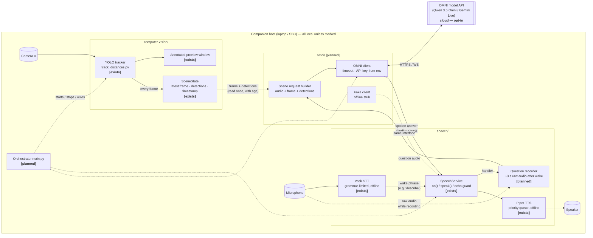
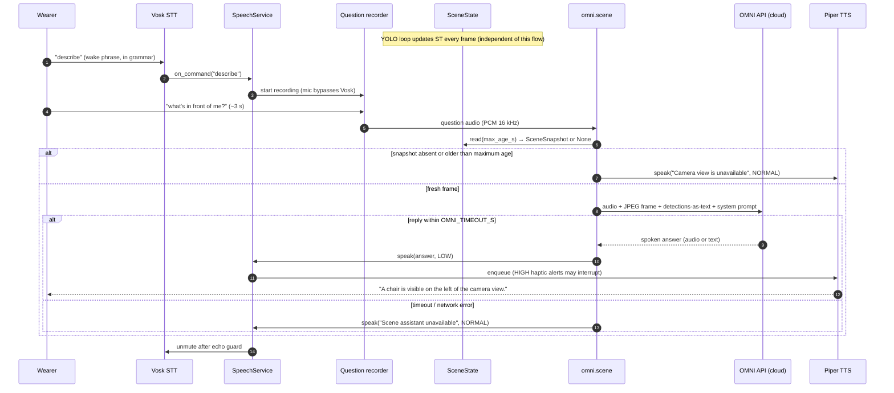

# Sixth-Sense — Software Architecture (YOLO + Vosk/Piper + OMNI)

> Scope: the companion-host software only — local vision (YOLO), local voice
> I/O (Vosk STT, Piper TTS), and the cloud OMNI multimodal assistant.
> Proximity sensors, haptics, and firmware are a separate local path and are
> deliberately **not** described here.
>
> Status legend used throughout: **[exists]** = in the repo today,
> **[planned]** = agreed design, not yet written.

## 1. One-paragraph summary

The wearer says a wake phrase, then asks a question ("what's in front of me?").
Vosk (offline, grammar-limited) catches the wake phrase; the next few seconds
of microphone audio are recorded. That audio, the current camera frame, and
YOLO's structured detection list are sent in **one** request to an OMNI model
(Qwen 3.5 Omni / Gemini Live). The model returns a short spoken answer, which
is played through the existing priority-aware speech queue. If the network is
down, the assistant reports itself unavailable; YOLO preview and local speech
keep running.

## 2. Components

| Component | Location | Status | Role |
| --- | --- | --- | --- |
| YOLO tracker | `computer-vision/track_distances.py` | [exists] | Ultralytics tracking on camera `0` with the local Objects365 checkpoint; annotated preview; object-to-object **pixel** distances |
| Scene state | `computer-vision/scene_state.py` | [exists] | Thread-safe latest original frame + detections + monotonic result-receipt timestamp; immutable snapshots, freshness filtering, and reset |
| Vosk STT | `speech/stt.py` | [exists] | Offline recognizer restricted to `configs/grammar.json`; background mic thread; fires `on_command(text)` |
| Piper TTS | `speech/tts.py` | [exists] | Offline synthesis with `LOW / NORMAL / HIGH` priority queue and interrupt |
| SpeechService | `speech/service.py` | [exists] | Singleton facade: `speech.on(cmd, handler)`, `speech.speak(text, priority)`; mutes the mic while the speaker plays (echo guard) |
| Question recorder | `speech/` (extension) | [planned] | After a wake phrase, capture ~3 s of raw mic audio for the assistant instead of feeding it to Vosk |
| OMNI client | `omni/client.py` | [planned] | Thin wrapper over the cloud API; key from env var; bounded timeout |
| Scene request builder | `omni/scene.py` | [planned] | Packs audio + frame + detections + system prompt into one request; unpacks the answer |
| OMNI fake | `omni/fake.py` | [planned] | Same interface, canned answer, no network — for tests and the offline demo |
| Orchestrator | `main.py` (new, top level) | [planned] | Starts everything, registers handlers, owns shutdown |

## 3. Top-level diagram



### Modalities (for the OMNI Live challenge)

| Modality | Where it enters | Where it is used |
| --- | --- | --- |
| Vision / video | Camera → YOLO → `SceneState` | Frame **and** detection list sent to OMNI; YOLO preview shown live |
| Speech / audio | Mic → Vosk (wake) → recorder (question) | Question audio sent to OMNI; answer spoken via Piper or OMNI's own audio |
| Language | OMNI reasoning over audio + image + detection text | Short grounded description returned to the wearer |

## 4. Sequence — "What's in front of me?"



Rules baked into this flow:

- The wake phrase is the **only** thing Vosk must recognise; the actual
  question is open-vocabulary and handled by OMNI.
- `SceneState` is read **once** per question, with its age. A frame older
  than the configured maximum is treated as "camera unavailable", never
  described.
- Assistant answers are queued at `Priority.LOW`; any `HIGH` alert from the
  haptic path interrupts them (already supported by `PiperTTS.speak(interrupt=True)`).
- The mic is muted while the speaker plays (existing echo guard), so the
  assistant's own voice cannot re-trigger the wake phrase.

## 5. Threads and blocking

| Thread | Owner | Must never block on |
| --- | --- | --- |
| Main thread | YOLO loop (`model.track(stream=True)` + `cv2.imshow`) | Network, TTS, STT |
| Vosk worker | `VoskSTT._run` | Anything but the audio queue |
| Piper worker | `PiperTTS._run` | Network |
| Sounddevice callbacks | `VoskSTT._audio_callback` / recorder | Anything (real-time audio thread) |
| Assistant thread (per question) | `omni` handler spawned by `SpeechService` dispatch | — this is the only thread allowed to wait on the cloud |

The `speech.on("describe", …)` handler runs on the **Vosk worker thread**.
It must return immediately — spawn the assistant thread, don't do the OMNI
call inline, or voice recognition freezes for the duration of the request.

## 6. Data passed between components

### `SceneState` (CV → assistant) [exists]

`SceneState` returns a frozen `SceneSnapshot` dataclass, containing frozen
`Detection` dataclasses. Field sketch below (not a serialized transport envelope):

```python
{
  "frame":       np.ndarray,          # original BGR frame, not the annotated one
  "captured_at": float,               # monotonic result read-completion; timing caveat below
  "width": int, "height": int,
  "detections": [
    {"class_id": 42, "class_name": "chair", "conf": 0.71,
     "xyxy": (x0, y0, x1, y1),        # four floats, original-image pixels, top-left origin
     "track_id": 7,                   # or None
     "region": "left"}                # left | center | right, by box-centre x / thirds
  ],
  "source_mode": "live",              # live | replay | simulated
  "sequence": 1                       # +1 per update; first update after reset is 1
}
```

Region thirds are **camera-view** positions ("left of the camera view"), not
wearer-relative directions — the preview is not yet verified for mirroring.
For centre x and width W: left is x < W/3; center is W/3 <= x < 2W/3;
right is x >= 2W/3. Exact boundaries belong to the region on the right.

`update(frame, boxes, names, source_mode)` copies the original BGR pixels into
immutable backing storage and extracts detections using the supplied class map.
The public detection list rejects mutation. Readers get independent array views
over the same read-only pixels; CPython snapshot-reference publication does not
wait for readers. The state retains only its latest publication, with no queue
and no JPEG encoding.

`read(max_age_s=None)` returns the latest snapshot or `None` when empty; with a
limit it also returns `None` if age is strictly greater than the limit. Equality
is fresh. `age_s()` returns the latest age, or `None` when empty. `reset()` clears
evidence and the sequence counter. The tracking loop resets at entry/exit;
automatic mid-stream reconnect detection and tracker reset remain planned.

The clock defaults to `time.monotonic` and can be injected for tests. With the
current minimal tracking integration, `captured_at` is sampled at `update()`
entry, when the loop has read a yielded YOLO result **after inference**. This is
result read-completion, not underlying camera read-completion or exposure time.
Age therefore excludes upstream buffering and inference. Capture timing remains
future work; do not interpret this age as total image latency. Replay uses local
processing time, not the recording's original timestamp.

The assistant should read once with its maximum age and compute text age using
that returned snapshot's `captured_at` and the same clock. A separate `age_s()`
call could observe a newer update. `to_text(detections, age_s)` formats the text
shown below, uses `none` for an empty list, and `age unknown` when age is `None`.
It never interprets empty detections as absence of hazards. The assistant should
recheck that same snapshot's age before sending a delayed request.

### OMNI request (assistant → cloud) [planned]

| Part | Content |
| --- | --- |
| System prompt | "Describe only what is in the camera view, in one short sentence. Use the detection list as ground truth. Never state distances, never say an area is clear, never claim to see behind the wearer. If unsure, say so." |
| Audio | The recorded question (PCM/WAV, 16 kHz mono) |
| Image | JPEG of the returned `SceneSnapshot.frame` (downscaled, e.g. 640 px wide) |
| Text | `Detected (age 80 ms): chair left 0.71, person center 0.82` |

### OMNI response → speech

- Preferred: text answer → `speech.speak(text, Priority.LOW)` (keeps one
  voice, one queue, interruptible by alerts).
- Alternative: model audio played directly — only if the demo needs the
  model's own voice; must still respect the echo guard and `HIGH` interrupts.

## 7. Degraded states

| Condition | Vision preview | Voice commands | Assistant answer |
| --- | --- | --- | --- |
| Normal | live | working | grounded description |
| Network down / API error / timeout | live | working (Vosk + Piper are offline) | "Scene assistant unavailable" |
| Camera disconnected or frame stale | frozen → must be flagged, not shown as current | working | "Camera view is unavailable" |
| No detections on a fresh frame | live | working | OMNI may still describe the image; the prompt forbids "nothing is there / area is clear" |
| `OMNI_FAKE=1` (demo/test switch) | live | working | canned answer from `omni/fake.py`, no network |

Demo moment: pull the network mid-run → preview and voice commands keep
working, assistant says it's unavailable, haptics (separate path) continue.

## 8. Changes required in existing code

| File | Change | Why |
| --- | --- | --- |
| `computer-vision/track_distances.py` | [exists] `main(state: SceneState \| None = None)` publishes original frame + all detections before plotting; source mode derives from `SOURCE`; reset at entry and in `finally` | Consumers share the latest evidence without calling OpenCV/YOLO; result-receipt timing limitation documented in §6 |
| `speech/stt.py` | Add a "capture raw audio for N seconds, bypassing the recogniser" mode, or expose the mic stream | Vosk cannot hear open-vocabulary questions |
| `configs/grammar.json` | Add the chosen wake phrase if not `describe` | Only grammar entries are recognised |
| `requirements.txt` | Add the OMNI SDK / `requests` / `websockets` as chosen | New dependency |
| `.gitignore` / env | `OMNI_API_KEY` from environment only | Never in code or logs |
| New `omni/` package | `client.py`, `scene.py`, `fake.py`, `__init__.py` | The assistant layer |
| New `main.py` | Start YOLO, configure `speech`, register `describe` handler, clean shutdown | One orchestrator instead of three separate scripts |

## 9. Configuration knobs (single place, e.g. `configs/assistant.json`)

| Key | Provisional default | Note |
| --- | --- | --- |
| `wake_phrase` | `"describe"` | Must be in `grammar.json` |
| `question_seconds` | `3.0` | Recording window after wake |
| `max_scene_age_ms` | `500` | Older frame ⇒ "camera unavailable"; **measure** before tuning |
| `omni_model` | `qwen3.5-omni-flash` | Request/response first; switch to `-realtime` / Gemini Live only after this works |
| `omni_timeout_s` | `5.0` | Hard cap; answer target is ≤ 3 s |
| `frame_jpeg_width` | `640` | Upload size vs latency |
| `cloud_enabled` | `false` | Must be explicitly turned on; state shown in preview title/log |

## 10. Open decisions

| Decision | Options | Recommendation |
| --- | --- | --- |
| Wake phrase | reuse `describe` vs new "hey sixth sense" | Reuse `describe` for the hackathon — already works |
| Answer voice | Piper (local) vs OMNI audio | Piper — one queue, offline fallback, interruptible |
| Model | Qwen flash (request/response) vs Qwen realtime / Gemini Live (streaming) | Flash first; streaming is a stretch goal |
| Keep pixel-distance overlay? | yes / no | Keep for preview; **do not** send pixel distances to OMNI — they are not ranges |
| Depth estimation | none / add a monocular model | None for the hackathon; camera-to-object range is not available from this pipeline |

## 11. What this architecture does **not** claim

- YOLO does not measure distance from the camera to objects. The on-screen
  numbers are pixel gaps between two objects.
- The assistant can only describe the camera's field of view — never "around
  me" in the 360° sense, never behind the wearer.
- An empty detection list or an unavailable frame is never "the area is clear".
- Latency (wake → first spoken word) is a goal of ≤ 3 s, **unmeasured** until
  the `omni/` layer exists.
