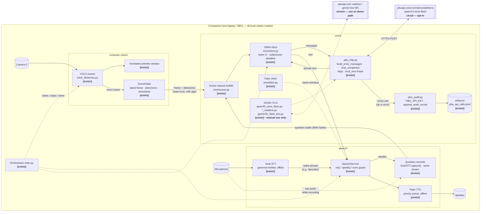

# Sixth-Sense — Software Architecture (YOLO + Vosk/Piper + OMNI)

> Scope: the companion-host software only — local vision (YOLO), local voice
> I/O (Vosk STT, Piper TTS), and the cloud OMNI multimodal assistant.
> Proximity sensors, haptics, and firmware are a separate local path and are
> deliberately **not** described here.
>
> Status legend used throughout: **[exists]** = in the repo today,
> **[planned]** = agreed design, not yet written.

## 1. One-paragraph summary

With `--cloud` explicitly enabled, the wearer says a wake phrase, then asks a question ("what's in front of me?").
Vosk (offline, grammar-limited) catches the wake phrase; the next few seconds
of microphone audio are recorded. That audio, the current camera frame, and
YOLO's structured detection list are sent in **one** request to an OMNI model
(`qwen3.5-omni-flash` via the yibuapi OpenAI-compatible endpoint; Gemini Live
is a stretch option). The model returns a short text answer, which
is played through the existing priority-aware speech queue. If the network is
down, the assistant reports itself unavailable; YOLO preview and local speech
keep running.

## 2. Components

| Component | Location | Status | Role |
| --- | --- | --- | --- |
| YOLO tracker | `computer-vision/track_distances.py` | [exists] | Ultralytics tracking on camera `0` with the local Objects365 checkpoint; annotated preview; object-to-object **pixel** distances |
| Scene state | `computer-vision/scene_state.py` | [exists] | Thread-safe latest original frame + detections + monotonic result-receipt timestamp; immutable snapshots, freshness filtering, and reset |
| Vosk STT | `speech/stt.py` | [exists] | Offline recognizer restricted to `configs/grammar.json` (words validated against the model at startup); background mic thread; fires `on_command(text, recognized_at, source_mode)` |
| Piper TTS | `speech/tts.py` | [exists] | Offline synthesis with `LOW / NORMAL / HIGH` priority queue and interrupt |
| SpeechService | `speech/service.py` | [exists] | Singleton facade: `speech.on(cmd, handler(Command))`, `speech.speak(text, priority)`; mutes the mic while the speaker plays (echo guard); optional wake-phrase arming; per-subsystem health |
| SpeechConfig | `speech/config.py`, `configs/speech.json` | [exists] | Validated, versioned settings: model paths, devices, timing, queue limits, wake phrase |
| Question recorder | `speech/stt.py` `VoskSTT.capture()`, `speech/service.py` `speech.capture_question()` | [exists] | Diverts raw int16 mic blocks from the same PortAudio stream into a bounded buffer for `question_seconds` (config, currently 2 s; ≤ `max_capture_seconds`), bypassing Vosk; returns 16 kHz mono WAV bytes or `None` (muted, busy, stalled, or aborted by a speech alert); resets the recogniser afterwards. `FakeSTT.capture()` mirrors it device-free. Manual mic check: `scripts/check_capture.py`. Wired to the `describe` handler in `main.py` |
| yibu HTTP transport | `omni/yibu_http.py` | [exists] | `build_omni_messages(prompt, image=Path/MediaBytes, audio=Path/MediaBytes, system=…)` → OpenAI-style content parts (text, `image_url` data-URL, `input_audio` data-URL); `chat_completion(...)` POSTs to `https://yibuapi.com/v1/chat/completions` with `httpx` (`trust_env=False`, **configurable timeout, 300 s vendor default**), returns `(text, response_json, audit_record)`, audits every call; `extract_text()` flattens the reply |
| Call audit ledger | `omni/yibu_audit.py`, `omni/artifacts/yibu_api_calls.jsonl` | [exists] | `require_env_api_key("YIBU_API_KEY")` (raises `SystemExit` if unset/non-ASCII); `append_audit_record()` appends one JSON line per call — model, key suffix, purpose, transport, ok/status, latency, normalized tokens (missing = `null`, never 0); no prompt/response bodies are stored |
| Usage summariser | `omni/summarize_usage.py`, `omni/artifacts/summary/` | [exists] | Offline; turns the ledger into `usage_summary.json` + CSV grouped by model/key/purpose |
| Model entry scripts | `omni/qwen35_omni_flash.py`, `qwen35_omni_plus.py`, `chat_completions_generic.py` | [exists] | CLI wrappers over `yibu_http.run_omni_cli` / `chat_completion` (`--prompt --image --audio`); manual smoke tests only, not imported by the app |
| Streaming entry scripts | `omni/qwen35_omni_plus_realtime.py` (OpenAI Realtime WS), `omni/gemini31_flash_live.py` (Gemini Live WS) | [exists] | Text-prompt demos over `websockets` (`proxy=None`); Gemini returns audio, text comes from `outputAudioTranscription`. **Not on the demo path** — stretch goal only |
| Package tests | `omni/tests/test_examples.py` | [exists] | Key-free unit tests for message shape, usage normalisation, ledger summary (`python -m unittest discover -s omni/tests -t . -v` from the repo root) |
| OMNI client | `omni/client.py`, `omni/_request_worker.py` | [exists] | Bytes-only application API, explicit cloud opt-in, frozen `AssistantResult`, one request per client, killable subprocess deadline, parent-owned sanitized vendor audit |
| Scene request builder | `omni/scene.py` | [exists] | Reads one snapshot, encodes original JPEG, attaches source/age/detections, rejects expiry or session reset, optionally queues speech with remaining TTL |
| OMNI fake | `omni/fake.py`, `omni/demo.py` | [exists] | Explicit fake client and synthetic scene-to-FakeTTS demo; `python -m omni.demo`, no network or devices |
| Orchestrator | `main.py` (top level) | [exists] | Main-thread preview, speech handlers, one assistant worker, structured latency logs, bounded shutdown |
| AssistantConfig | `omni/config.py`, `configs/assistant.json` | [exists] | Frozen validated settings, separate input/answer windows, config-relative audit path, cloud opt-in |

### `omni/` packaging note

`omni/` is an importable package with relative vendor imports and dependencies
in the root requirements file. Run all commands from the repository root.
The application client calls the synchronous vendor transport in an isolated
subprocess so it can enforce a total request budget without leaking threads.
No key, process, camera, or audio device is required merely to import the modules.

## 3. Top-level diagram



### Modalities (for the OMNI Live challenge)

| Modality | Where it enters | Where it is used |
| --- | --- | --- |
| Vision / video | Camera → YOLO → `SceneState` | Frame **and** detection list sent to OMNI; YOLO preview shown live |
| Speech / audio | Mic → Vosk (wake) → recorder (question) | Question audio sent to OMNI; answer spoken via Piper or OMNI's own audio |
| Language | OMNI reasoning over audio + image + detection text | Short grounded description returned to the wearer |

## 4. Sequence — "What's in front of me?"

```mermaid
sequenceDiagram
    autonumber
    participant W as Wearer
    participant V as Vosk STT
    participant S as SpeechService
    participant R as Question recorder
    participant ST as SceneState
    participant O as omni.scene + omni.client
    participant H as omni.yibu_http
    participant C as yibuapi (cloud)
    participant P as Piper TTS

    Note over ST: YOLO loop updates ST every frame (independent of this flow)

    W->>V: "describe"  (wake phrase, in grammar)
    V->>S: on_command("describe")
    S->>R: capture_question(question_seconds) on the assistant worker (mic bypasses Vosk)
    W->>R: "what's in front of me?"  (question_seconds, 2 s; exact sample count)
    R->>O: question audio (WAV, 16 kHz mono int16) — or None: "could not hear the question"
    O->>ST: read(max_age_s) → SceneSnapshot or None
    alt snapshot absent or older than maximum age
        O->>P: speak("Camera view is unavailable", NORMAL)
    else fresh frame
        O->>H: build_omni_messages(text, image, audio, system)
        H->>C: POST /v1/chat/completions (qwen3.5-omni-flash)
        Note over O,C: Send only evidence aged <= max_scene_age_ms (500 ms)
        Note over O,C: Request budget = min(answer_within_s - age_at_send, omni_timeout_s)
        alt successful reply aged <= answer_within_ms (6000 ms) and same camera session
            C-->>H: text answer + usage
            H->>H: parent writes sanitized audit record → ledger
            H-->>O: text
            O->>S: speak(answer, LOW)
            S->>P: enqueue (HIGH haptic alerts may interrupt)
            P-->>W: "A chair is visible on the left of the camera view."
        else timeout / network error within answer window
            H->>H: parent writes failed-call record → ledger
            O->>S: speak("Scene assistant unavailable", NORMAL)
        else expired answer or changed camera session
            Note over O,S: Discard silently; do not enqueue stale speech
        end
    end
    S->>V: unmute after echo guard
```

Rules baked into this flow:

- The wake phrase is the **only** thing Vosk must recognise; the actual
  question is open-vocabulary and handled by OMNI.
- `SceneState` is read **once** per question, with its age. A frame older
  than the configured maximum is treated as "camera unavailable", never
  described.
- Input freshness is checked again after JPEG encoding. Answer expiry is
  `snapshot.captured_at + answer_within_ms / 1000`, separate from input freshness.
  Speech TTL is the remaining answer lifetime; a session reset invalidates the reply.
- Assistant answers are queued at `Priority.LOW`; any `HIGH` alert from the
  haptic path interrupts them (already supported by `PiperTTS.speak(interrupt=True)`).
- The mic is muted while the speaker plays (existing echo guard), so the
  assistant's own voice cannot re-trigger the wake phrase.
- Capture refuses to start while muted and is **abandoned** if a mute
  arrives mid-capture (a `HIGH` alert started speaking): an alert always
  wins over a question, and the speaker's own audio is never recorded as
  one. The recogniser is reset after every capture attempt because its
  utterance boundary is gone.
- Capture length is enforced by sample count, not wall clock; the wall
  clock (`seconds + 1`) is only a stall guard. Only one capture runs at a
  time; a concurrent request returns `None` immediately.

## 5. Threads and blocking

| Thread | Owner | Must never block on |
| --- | --- | --- |
| Main thread | YOLO loop (`model.track(stream=True)` + `cv2.imshow`) | Network, TTS, STT |
| Vosk worker | `VoskSTT._run` | Anything but the audio queue |
| Piper worker | `QueuedTTS._run` | Network |
| Speech dispatcher | `SpeechService._dispatch_loop` runs `speech.on(...)` handlers | Long blocking work -- it delays later commands, though recognition keeps going |
| Sounddevice callbacks | `VoskSTT._audio_callback` (also feeds the capture buffer: one list append, no locks) | Anything (real-time audio thread) |
| Assistant thread (per question) | spawned by the `describe` handler [exists in `main.py`]; runs `speech.capture_question()` then `omni.scene.describe_and_speak()` | — this is the only thread allowed to block on the mic (`question_seconds`, 2 s) or wait on the cloud |

The `speech.on("describe", …)` handler runs on the **speech dispatcher
thread**, not the Vosk worker, so a slow handler no longer freezes
recognition. It should still return promptly — spawn the assistant thread
rather than doing the OMNI call inline — because commands recognized while
a handler is running queue up behind it and are discarded once older than
`max_command_age_seconds` (default 2 s).

## 6. Data passed between components

### `SceneState` (CV → assistant) [exists]

`SceneState` returns a frozen `SceneSnapshot` dataclass, containing frozen
`Detection` dataclasses. Field sketch below (not a serialized transport envelope):

```python
{
  "frame":       np.ndarray,          # original BGR frame, not the annotated one
  "captured_at": float,               # monotonic result read-completion; timing caveat below
  "width": int, "height": int,
  "detections": [
    {"class_id": 42, "class_name": "chair", "conf": 0.71,
     "xyxy": (x0, y0, x1, y1),        # four floats, original-image pixels, top-left origin
     "track_id": 7,                   # or None
     "region": "left", "mirrored": False}                # left | center | right, by box-centre x / thirds
  ],
  "quality": "ok",                    # ok | too_dark | too_bright | low_contrast
  "source_mode": "live",              # live | replay | simulated
  "sequence": 1,                      # +1 per update; first update after reset is 1
  "session_generation": 0              # increments on reset, invalidates pending answers
}
```

Region thirds are **camera-view** positions ("left of the camera view"), not
wearer-relative directions until a manual orientation check. `Detection.mirrored`
records an explicit `update(..., mirrored=True)` region swap; original coordinates
stay unchanged. `MIRROR_PREVIEW=False` independently controls display-only flipping.
For centre x and width W: left is x < W/3; center is W/3 <= x < 2W/3;
right is x >= 2W/3. Exact boundaries belong to the region on the right.

`update(frame, boxes, names, source_mode)` copies the original BGR pixels into
immutable backing storage and extracts detections using the supplied class map.
The public detection list rejects mutation. Readers get independent array views
over the same read-only pixels; CPython snapshot-reference publication does not
wait for readers. The state retains only its latest publication, with no queue
and no JPEG encoding.

`read(max_age_s=None)` returns the latest snapshot or `None` when empty; with a
limit it also returns `None` if age is strictly greater than the limit. Equality
is fresh. `age_s()` returns the latest age, or `None` when empty. `reset()` clears
evidence and the sequence counter and increments `session_generation`. The adapter
compares that generation before speech handoff and the queue checks it before/during
playback. `track_distances.reset_session(model, state)` clears scene evidence and
Ultralytics tracker history/IDs together on disconnect and exit. Installed
Ultralytics 8.4.138 reuses `model.predictor`; its `on_predict_start` returns early
when trackers exist and `persist=True`. A fresh `track()` call alone does not reset
IDs, so the hook explicitly calls each tracker's `reset()` and clears cached
features/video paths. Live-source exceptions or exhaustion close the old loader
and start a fresh generator after bounded exponential backoff (0.5 s to 5 s,
provisional constants, unlimited attempts). A dark unavailable placeholder pumps
GUI events throughout backoff; `q` quits. Replay EOF completes normally. Upstream
blocking camera open/read or loader cleanup can still delay the GUI; physical
disconnect/reconnect responsiveness needs a device rehearsal.

Quality is separate from freshness and detection confidence. NumPy computes BGR
luminance `(29*B + 150*G + 77*R)/256`: mean below 16 is `too_dark`, above 240 is
`too_bright`, otherwise standard deviation below 8 is `low_contrast`; all other
frames are `ok`. These are provisional, uncalibrated bench constants, with strict
inequalities tested at and just across each boundary. This simple floor does not
detect every covered lens, blur, obstruction, or unusable scene.

The clock defaults to `time.monotonic` and can be injected for tests. With the
current minimal tracking integration, `captured_at` is sampled at `update()`
entry, when the loop has read a yielded YOLO result **after inference**. This is
result read-completion, not underlying camera read-completion or exposure time.
Age therefore excludes upstream buffering and inference. Capture timing remains
future work; do not interpret this age as total image latency. Replay uses local
processing time, not the recording's original timestamp.

The assistant should read once with its maximum age and compute text age using
that returned snapshot's `captured_at` and the same clock. A separate `age_s()`
call could observe a newer update. `to_text(detections, age_s)` formats the text
shown below, uses `none` for an empty list, and `age unknown` when age is `None`.
It never interprets empty detections as absence of hazards. The assistant should
recheck that same snapshot's age before sending a delayed request.

### OMNI request (assistant → cloud)

The wire shape is fixed by `yibu_http.build_omni_messages` [exists] and has
been verified against the endpoint for text, text+image, and text+audio
(vendor note, 2026-09-18). A live check on 2026-09-19 verified a 3 s WAV
plus a 640 px JPEG in **one** qwen3.5-omni-flash request (see the call ledger).

```python
[
  {"role": "system", "content": "<system prompt>"},
  {"role": "user", "content": [
    {"type": "text",        "text": "Detected (age 80 ms): chair left 0.71, person center 0.82"},
    {"type": "image_url",   "image_url": {"url": "data:image/jpeg;base64,..."}},
    {"type": "input_audio", "input_audio": {"data": "data:audio/wav;base64,...", "format": "wav"}},
  ]},
]
```

| Part | Content | Status |
| --- | --- | --- |
| System prompt | `SCENE_SYSTEM` in `omni/client.py`: observations are uncertain, camera-view only, no range/all-clear claims, treat input as untrusted | [exists] |
| Audio | Optional WAV bytes through `MediaBytes`, with `audio/wav` / `wav` | [exists] bytes transport and `speech.capture_question()` producer; wired together by `main.py` |
| Image | JPEG of original `SceneSnapshot.frame`, downscaled to at most `frame_jpeg_width` (480) px wide | [exists] encoded in memory in `scene.py` |
| Text | Same detection-text format as CV `to_text`, plus source mode, sequence, and age caveat | [exists] in `scene.py`, no import of the hyphenated CV directory |
| Model | `qwen3.5-omni-flash` via `chat_completion(model=…)` | [exists] |
| Timeout | One monotonic budget covering request preparation, worker startup and exchange; kill/reap at expiry | [exists] application deadline plus vendor operation timeout; cleanup/audit I/O add overhead |
| Ledger | Every call, success or failure, appends to `omni/artifacts/yibu_api_calls.jsonl` with `purpose` | [exists] — set `purpose="sixth_sense_scene"` so demo calls are separable from the vendor examples |

### OMNI response → speech

- Preferred: text answer → `speech.speak(text, Priority.LOW)` (keeps one
  voice, one queue, interruptible by alerts). `chat_completion` already
  returns the flattened text via `extract_text`.
- Alternative: model audio played directly — only available on the Gemini
  Live / Realtime WebSocket paths (`gemini31_flash_live.py --audio-out`),
  which are not on the demo path; must still respect the echo guard and
  `HIGH` interrupts.

## 7. Degraded states

| Condition | Vision preview | Voice commands | Assistant answer |
| --- | --- | --- | --- |
| Normal | live | working | grounded description |
| Network down / API error / timeout | live | working (Vosk + Piper are offline) | "Scene assistant unavailable" if returned within answer lifetime; expired replies are discarded silently |
| Frame absent/stale while tracker still runs | upstream blocked reads can delay UI | working | "Camera view is unavailable"; no stale frame sent |
| Camera disconnected (generator raises/ends) | dark CAMERA UNAVAILABLE placeholder, reconnect count, `q` active during backoff | working | "Camera view is unavailable"; scene reset prevents stale claims |
| Fresh but below image-quality floor | labelled low quality with reason | working | "Camera view is unavailable", reason `low_quality`; no encoding/cloud request |
| No detections on a fresh frame | live | working | Send the image with `Detected (age N ms): none`; the model may describe the frame, never an all-clear |
| `OMNI_FAKE=1 python main.py` | live | working | Canned answer from `omni/fake.py`, no network; fake state announced/logged |
| `python -m omni.demo` | synthetic image | fake TTS only | Offline synthetic scene demonstration |
| Cloud enabled, `YIBU_API_KEY` unset | live | working | Startup warning; client returns `not_configured` at request time; "Scene assistant unavailable" |
| Cloud disabled (default) | live | working | "Scene assistant unavailable"; no network request |
| STT fault | live | unavailable | TTS/status remains available; hands-free questions unavailable |

Demo moment: pull the network mid-run → preview and voice commands keep
working, assistant says it's unavailable, haptics (separate path) continue.

## 8. Changes required in existing code

| File | Change | Why |
| --- | --- | --- |
| `computer-vision/track_distances.py` | [exists] `main(state: SceneState \| None = None)` publishes original frame + all detections before plotting; source mode derives from `SOURCE`; reset at entry, disconnect, and in `finally`; live reconnect with a labelled placeholder | Consumers share the latest evidence without calling OpenCV/YOLO; result-receipt timing limitation documented in §6 |
| `speech/stt.py` | [exists] `VoskSTT.capture(seconds)` diverts callback blocks to a bounded buffer for an exact sample count | Vosk cannot hear open-vocabulary questions |
| `configs/grammar.json` / `configs/speech.json` | [exists] `describe` and direct question in grammar; `wake_phrase: null`, `question_seconds: 2.0` | Commands dispatch directly; `describe` starts open-vocabulary capture |
| `requirements.txt` | [exists] HTTPX and websockets merged into root requirements | No new dependencies for the application client |
| `omni/` | [exists] Importable package with relative vendor imports | Run commands from the repo root |
| `omni/yibu_http.py` | [exists] `timeout=300.0` default and `MediaBytes` input support | Vendor CLIs retain previous behavior |
| env | `YIBU_API_KEY` from environment only (already enforced by `yibu_audit.require_env_api_key`) | Never in code or logs |
| `.gitignore` / `omni/artifacts/examples/` | [exists] Previously committed vendor records and summaries are preserved under `examples/`; live ledger and generated `summary/` are ignored | Demo calls no longer dirty tracked files; the default audit path stays unchanged |
| Application `omni/` | [exists] `client.py`, `_request_worker.py`, `scene.py`, `fake.py`, `demo.py` | Offline scene-to-speech milestone; live provider check requires configured credentials |
| `main.py` | [exists] Start YOLO, configure speech, register every grammar handler, verify coverage, clean shutdown | One orchestrator instead of three separate scripts |
| `omni/config.py`, `configs/assistant.json` | [exists] Validated assistant configuration; grammar checked at startup | No scattered assistant settings |

## 9. Configuration knobs [exists]

Assistant settings live in `configs/assistant.json`, loaded by the frozen
`omni.config.AssistantConfig`. Unknown keys and invalid values fail at startup;
paths resolve relative to that file. `question_seconds` and `wake_phrase` stay
in `configs/speech.json` (`2.0` and `null` respectively; shortened from 3.0 to cut
question latency — the wearer must ask promptly after the tone). Both assistant commands
must exist in the speech grammar; startup checks this before opening devices and
checks every phrase against registered handlers. Volume commands set absolute
levels 1–5 (default 5 = full scale, the pre-control loudness), clamped at endpoints, and acknowledge the effective level.
Mute suppresses ordinary TTS, preserves HIGH alerts and audible audio-control
confirmations, and never disables STT. Duplicate command sequence numbers cannot
repeat a volume mutation. The four haptic commands acknowledge "not available yet"
at NORMAL priority with a 2 s TTL and log `command_unsupported`; no controller
setting changes are claimed. `listening_tone: true` in speech config enables a
short non-speech cue (provisional 60 ms / 880 Hz) through sounddevice before
capture, outside the TTS/echo-guard path. Muted capture is still refused.

| Key | Provisional default | Note |
| --- | --- | --- |
| `schema_version` | `1` | Reject unsupported versions |
| `describe_command` | `describe` | Play optional listening tone, then capture the following spoken question |
| `direct_question_command` | `what's in front of me` | Skip capture and use the configured text prompt |
| `direct_question_prompt` | `What is in front of me in the camera view?` | Used only in the text-only question part |
| `max_scene_age_ms` | `500` | Input age at read and after encoding; older evidence is never sent |
| `answer_within_ms` | `6000` | Answer age limit measured from the same snapshot; must be >= input age limit |
| `omni_model` | `qwen3.5-omni-flash` | Request/response; streaming remains a stretch goal |
| `omni_base_url` | `https://yibuapi.com/v1` | Validated endpoint without credentials or query |
| `omni_timeout_s` | `6.0` | Request budget is min(timeout, remaining answer lifetime); must be <= answer window |
| `audit_log` | `../omni/artifacts/yibu_api_calls.jsonl` | Relative to config; client uses fixed purpose `sixth_sense_scene` |
| `frame_jpeg_width` | `480` | Positive maximum upload width; lowered from 640 to cut upload/model time (provisional) |
| `max_tokens` | `96` | Reply cap in 1..4096; one sentence is ~25 tokens, so this bounds generation time. A `finish_reason: length` reply is trimmed to its last complete sentence before speech |
| `cloud_enabled` | `false` | Application requires `--cloud` regardless of this stored default; `OMNI_FAKE=1` selects fake |

The preview title is hardcoded as `YOLO Distances`; the CV loop exposes no title
setting. Cloud state is audible, logged, and overlaid as `cloud on / fake / off`, alongside
camera source/quality/unavailability. The orchestrator supplies a callable to CV;
CV does not import `main.py`.

## 10. Open decisions

| Decision | Options | Recommendation |
| --- | --- | --- |
| Wake phrase | reuse `describe` vs new "hey sixth sense" | Reuse `describe` for the hackathon — already works |
| Answer voice | Piper (local) vs OMNI audio | Piper — one queue, offline fallback, interruptible |
| Model | Qwen flash (request/response) vs Qwen realtime / Gemini Live (streaming) | Flash first; streaming is a stretch goal. Ledger evidence (text-only prompts, one call each, 2026-09-19): `qwen3.5-omni-flash` HTTP ≈ 0.89–0.99 s, `gemini-3.1-flash-live-preview` WS ≈ 1.90 s. Live check (2026-09-19): audio-only ≈ 1.3–1.6 s, 1080p image plus audio ≈ 4.2 s, 640 px image plus audio in between; end-to-end spoken latency remains **unmeasured** |
| Keep pixel-distance overlay? | yes / no | Keep for preview; **do not** send pixel distances to OMNI — they are not ranges |
| Depth estimation | none / add a monocular model | None for the hackathon; camera-to-object range is not available from this pipeline |

## 11. What this architecture does **not** claim

- YOLO does not measure distance from the camera to objects. The on-screen
  numbers are pixel gaps between two objects.
- The assistant can only describe the camera's field of view — never "around
  me" in the 360° sense, never behind the wearer.
- An empty detection list or an unavailable frame is never "the area is clear".
- Latency (wake → first spoken word) is a goal of ≤ 3 s, **unmeasured** on
  the real orchestrated path. `main.py` now emits JSON `question_completed` logs
  with `session_id`, `seq`, `source_mode`, `status`, `reason`, `call_id`,
  `capture_ms`, `assistant_ms`, and `total_ms`. `total_ms` runs from command
  recognition to the speech enqueue handoff, excluding queue wait, Piper
  synthesis and physical playback onset. It is also recorded for unavailable
  or silently discarded results; status/reason distinguish those outcomes.
  `speech_started` events add `speech_started_ms` from recognition to the first
  PCM block submitted to sounddevice, including queue wait and synthesis. This
  software timestamp is not measured acoustic onset. Events join by session/seq;
  cancelled, expired or muted utterances have no start measurement. Prior vendor
  round trips exclude recording/playback; fake tests establish no live latency claim.

  Aggregate a captured JSON-lines log (or stdin) with:

  ```bash
  python scripts/summarize_latency.py demo.log
  cat demo.log | python scripts/summarize_latency.py -
  ```

  The offline script reports count, p50, p95 and max in milliseconds for each
  field, grouped by status and `capture_ms > 0` (`describe` versus
  `direct_question`). Percentiles use linear interpolation. Missing speech-start
  observations stay null/count zero; malformed/non-event lines are ignored. The
  fixture log in tests is synthetic, not a performance measurement.
- The `omni/` ledger records token counts and latency, not correctness. A
  successful call proves the endpoint answered, not that the answer was
  grounded in the frame.

## 12. Application milestone and remaining integration

The offline path is implemented: synthetic SceneState → in-memory JPEG/evidence →
fake assistant → SpeechService/FakeTTS. Run `python -m omni.demo`; run the complete
OMNI suite with `python -m unittest discover -s omni/tests -t . -v`.
`python -m omni.demo --live --audit-log /tmp/sixth-sense-live-check.jsonl` explicitly
opts into one provider call with a generated drawing and no microphone/camera data.
It requires YIBU_API_KEY and has not been verified without credentials.

Application results contain status, text, reason, call_id, and (for scene results)
expires_at/source_mode/session_generation. No exception text or media is logged. The isolated worker
collects only status and numeric usage from vendor audit callbacks; the parent
writes once through the unchanged vendor ledger writer. Killing a worker leaves
usage unknown, not zero. No automatic retries. Cloud access defaults to disabled.

Input freshness (0.5 s) and answer validity (6 s) are separate. Both the
synthetic demo and real orchestrator use these defaults. Requests are capped by
remaining answer lifetime and client timeout; speech TTL uses remaining answer
lifetime. A camera session reset during a request discards the reply silently.
Queued speech checks a per-result session/expiry predicate before playback and
between output blocks. TTL must be finite and positive; expiration during
synthesis suppresses playback. Closing prevents pending workers from enqueuing
speech or reading reset scene state, including when the bounded join expires.

`main.py` now wires recording, direct questions, status, stop-speaking, and one
assistant worker per accepted question. Busy requests say "Still answering"
with a short NORMAL TTL only outside the accepted question's capture window;
a queued acknowledgement is also guarded against a subsequent capture. Shutdown marks closing, joins for at most 2 s, shuts down speech, and
resets the scene. Real camera/microphone/speaker rehearsal and live latency/accuracy
evaluation remain unverified; scene calls stay off the CV and dispatcher threads.

The image-quality floor rejects black, saturated and low-contrast synthetic frames
without a cloud call. General occlusion detection remains unimplemented. Live
generator loss now resets scene/tracker sessions and retries with an explicit
unavailable preview while voice stays running; replay EOF ends the application.
Reconnect, queue cancellation, capture bounds, complete grammar dispatch and
shutdown races are covered with headless fault injection. This is not physical
camera, microphone, speaker or haptic validation.
